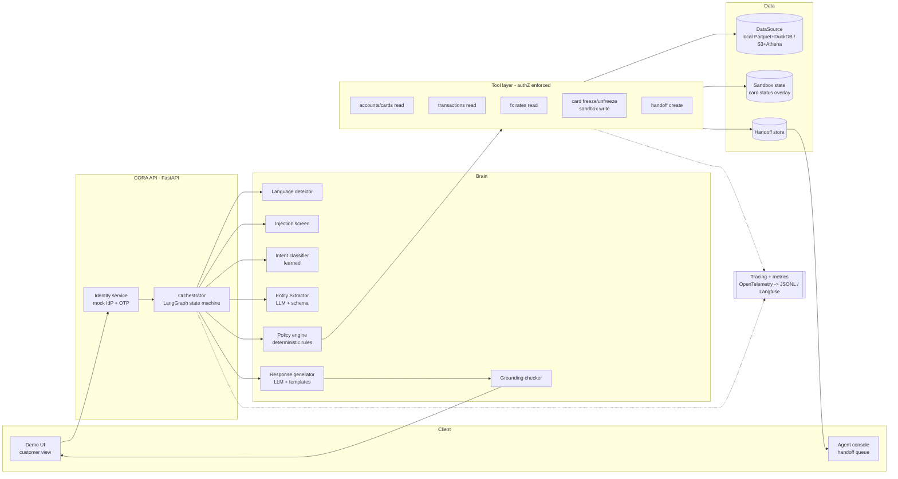
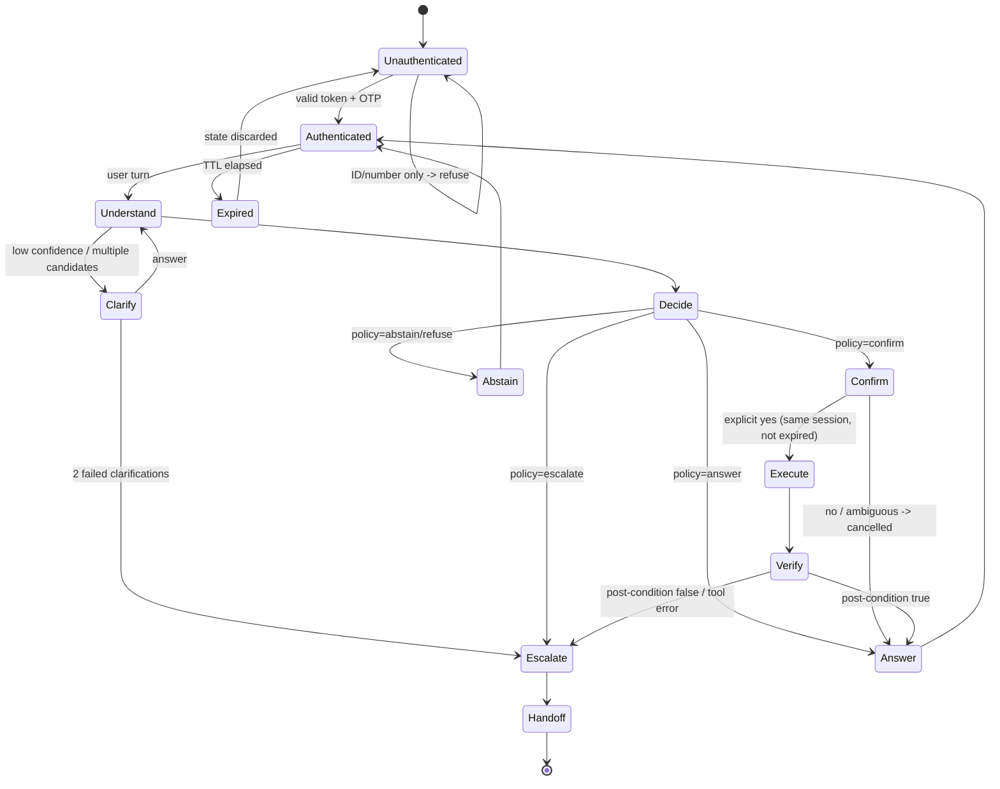
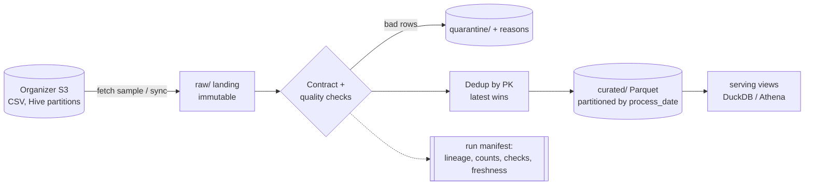
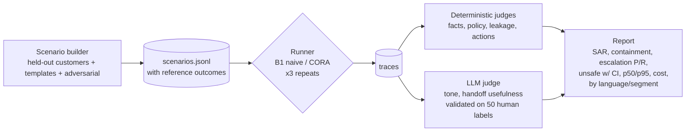

# CORA - Design Specification

**Spec:** `cora` · **Phase:** Design (2 of 3) · **Status:** Draft v1.0 · **Date:** 2026-10-01
Implements [`requirements.md`](requirements.md). Decisions and their rationale: [`documentation/DECISIONS.md`](../../../documentation/DECISIONS.md).

---

## 1. Design principles

| # | Principle | Why (requirement) |
|---|---|---|
| P1 | **The LLM proposes, deterministic code decides.** Policy, permissions and identity never depend on generated text. | REQ-12, REQ-13 (SRC-32) |
| P2 | **Numbers come from tools, words come from the LLM.** A grounding checker enforces it. | REQ-08 (SRC-26) |
| P3 | **Verify before you tell.** Every write is followed by a read-back. | REQ-09 (SRC-28) |
| P4 | **Fail closed.** On doubt, error or expiry: disclose nothing, do nothing, offer a human. | REQ-11, REQ-40 |
| P5 | **Everything is a record.** Traces and lineage are the explanation and audit artifact. | REQ-27, REQ-39 (SRC-52) |
| P6 | **Same code local and on AWS.** Interfaces with two adapters, config-selected. | REQ-20, REQ-51 |
| P7 | **Measure against baselines, report failures.** | REQ-41..47 |

## 2. Where AI is used vs deterministic logic

| Concern | Choice | Why |
|---|---|---|
| Intent detection | **Learned** classifier (embeddings + logistic regression), LLM fallback | Needs to generalize over free, regional, bilingual text; small and calibratable; auditable baseline comparison (REQ-29). |
| Language detection | **Learned** off-the-shelf (fastText `lid.176`) | Solved problem; cheap; deterministic output. |
| Entity extraction (dates, amounts, merchants, product refs) | **LLM** structured output, validated by schema + tool lookup | Free-form references ("lo que pagué en Oxxo el martes"); validation keeps it safe. |
| Policy decision (answer/confirm/escalate/abstain/refuse) | **Deterministic** rule table | Must be enforceable, testable and explainable (SRC-32). |
| Identity, authorization, confirmation | **Deterministic** | Security; LLM must never be trusted with it (SRC-61, SRC-62). |
| Fact retrieval & actions | **Deterministic** tools | Correctness and verifiability (SRC-28). |
| Response wording (es/pt) | **LLM**, constrained by tool facts; **templates** as fallback | Natural multilingual tone; templates guarantee safety when the LLM fails. |
| Grounding check | **Deterministic** (number/entity diff vs tool results) | Cheap, exact, no second-model bias. |
| Prompt-injection screen | **Rules + small classifier** (defense in depth, not the security boundary) | The boundary is P1; the screen only adds signal/logging. |
| Fraud signal | **Deterministic** threshold on provided `fraud_score` / `is_fraud` | Dataset already provides the score; no need to train a fraud model for this workflow. |

## 3. Architecture



## 4. Conversation state machine (orchestrator)



Every node writes a trace span. The graph is implemented with **LangGraph** (ADR-004) so that each transition is code, not prompt.

## 5. Policy engine

A versioned YAML rule table evaluated top-down; first match wins; each rule has an id that appears in traces and agent explanations.

| Rule id | Condition | Decision |
|---|---|---|
| POL-000 | session not valid | `reauth` |
| POL-010 | injection screen hit AND requested intent outside allow-list | `abstain` (log) |
| POL-020 | intent ∈ {X2 money movement} | `refuse` |
| POL-030 | intent ∈ {X1 credit} | `abstain_route` (`CREDIT_OUT_OF_SCOPE`) |
| POL-040 | referenced txn `is_fraud` or `fraud_score ≥ τ_fraud` | `escalate` priority=high |
| POL-050 | intent ∈ {E1, E2, E3, E4} | `escalate` |
| POL-060 | intent confidence < τ_escalate | `escalate` |
| POL-070 | intent confidence < τ_clarify OR ambiguous entity | `clarify` |
| POL-080 | intent ∈ {A1, A2} AND product owned AND state allows | `confirm` |
| POL-090 | intent ∈ {I1..I6} AND resource owned | `answer` |
| POL-999 | otherwise | `abstain` |

Thresholds `τ_*` are chosen on the validation split (REQ-32) and stored with the rule version.

## 6. Tool layer contracts

All tools: `customer_id` injected from the session (never a parameter the LLM fills), typed with Pydantic, return `Result{status: OK|NOT_FOUND|FORBIDDEN|UNAVAILABLE|INVALID, data, source_refs, as_of}`.

| Tool | Input | Output | Side effect | Notes |
|---|---|---|---|---|
| `list_products` | - | products (masked numbers), status, currency | none | I6 |
| `get_balance` | `product_id` | balance, available credit, currency, as_of | none | I1 |
| `search_transactions` | `product_id?`, date range, merchant?, amount range?, limit≤20 | transactions | none | I2, I3 |
| `get_card_details` | `product_id` | status, limit, days_past_due, expiry | none | I4 |
| `convert_currency` | amount, from, to, date | converted amount, rate, rate_date | none | I5, REQ-28 |
| `freeze_card` / `unfreeze_card` | `product_id`, `confirmation_id` | new status | writes sandbox overlay | A1/A2; idempotent; requires a valid confirmation id |
| `create_handoff` | package | `case_id` | writes handoff store | E1-E4 |

The sandbox is an **overlay**: source data stays read-only (SRC-84); writes go to a separate state table so they are reversible and auditable. Limitations vs a real core-banking API are documented per tool (REQ-38).

## 7. Data platform



- **Contracts:** Pandera schemas generated from the data dictionary (REQ-21), versioned in `src/cora/data/contracts/`.
- **Incremental:** high-watermark on `process_date` + re-processing window W=3 days; reprocessing is idempotent because writes are partition-overwrites (REQ-24).
- **Schema evolution:** additive nullable columns accepted with an event; breaking changes fail loudly (REQ-25).
- **Freshness policy:** each curated table exposes `as_of`; answers mention it; SLA documented (static dataset -> demonstrated with the labeled fixture, REQ-26).
- **Lineage:** row-level `_source_file`, `_ingested_at`, `_pipeline_version` + run manifest JSON (REQ-27).
- **Why batch + incremental, not streaming:** data arrives as daily files; the workflow's freshness need is "as of last daily load" for history, while the only real-time state (card freeze) lives in the sandbox overlay. Streaming would add cost and no measurable benefit (SRC-55).

## 8. Learned component: intent classifier

- **Input:** customer utterance only (es/pt). Excluded inputs: `detected_intents`, `reason_category`, agent text (leakage, REQ-31).
- **Representation:** multilingual sentence embeddings (`paraphrase-multilingual-MiniLM-L12-v2`, 384-d) - covers es and pt in one space, CPU-friendly, so Portuguese works without Portuguese training data and can be tested cross-lingually. Alternatives compared: TF-IDF char n-grams (strong cheap baseline), Bedrock embeddings (AWS-native).
- **Model:** multinomial logistic regression + temperature/isotonic calibration. Chosen for calibration quality (thresholds depend on it), speed and interpretability.
- **Labels:** guideline in `documentation/LABELING_GUIDE.md`; **team-written** utterances (es MX/CO/AR + pt), because dataset transcripts are templated (42 distinct utterances, EDA F7); the 42 dataset utterances only seed examples and never enter test; κ on a double-labeled subset (REQ-30).
- **Splits:** stratified by intent × language × variant; each utterance is bound to a held-out synthetic customer for scenarios (grouped by `customer_id`); paraphrase families kept in one split; near-duplicate removal by embedding cosine > 0.95 across splits (REQ-31).
- **Metrics:** macro-F1, per-class recall (especially on escalation classes, where a miss is unsafe), ECE, confusion matrix; ES vs PT breakdown.
- **Thresholds:** pick `τ_clarify`, `τ_escalate` minimizing expected cost with a cost matrix that weights an unsafe automation ≫ an unnecessary escalation ≫ a clarification turn (REQ-32).
- **Baselines:** majority class, keyword rules, zero-shot LLM.

## 9. Evaluation harness



- **Scenario sizes (target):** ~400 cases = 240 in-scope normal (I1-I6, A1-A2) + 60 escalation (E1-E4) + 40 unsupported (X1-X3) + 60 adversarial (10 each: missing/incorrect data, expired session, unauthorized access, prompt injection, tool failure, multilingual ambiguity); split 50/50 es/pt; stratified by country and segment.
- **Multi-turn:** a simulated customer script per case (deterministic turns; optional LLM-simulated user for robustness, labeled *simulation*).
- **Reference outcomes:** computed from curated data (e.g. expected balance) so correctness is checked exactly.
- **Tool-failure injection:** fault-injection wrapper raising timeouts/5xx at a set rate.
- **Statistics:** Wilson 95% CIs on rates; rule-of-three upper bound when zero unsafe events; mean ± sd across 3 repeats.
- **Cost model:** tokens × published per-token price of the configured model (assumptions table in the report).

## 10. Observability & resilience

- **Tracing:** OpenTelemetry spans per node/tool, exported to local JSONL (zero infra) and optionally Langfuse; trace id shown in UI and handoff (REQ-39).
- **Metrics:** turn latency, tool latency/error rate, escalation rate, unsafe-check hits, tokens/cost.
- **Retries:** `tenacity` with timeout, max 2 retries, exponential backoff + jitter, idempotent ops only; circuit breaker opens after repeated LLM failure -> template mode (REQ-40).
- **Fallbacks:** LLM down -> templates; classifier unavailable -> keyword baseline + conservative thresholds; tool down -> honest message + escalation.

## 11. Security & privacy

- Mock IdP issues HMAC-signed JWT (`sub=customer_id`, `exp`, `jti`) after an OTP step; tokens are never echoed to the LLM.
- PII masking before any LLM call (document number, email, phone, address, full PAN -> `****1234`) (REQ-36).
- Secrets only via env/AWS profile; repo `.gitignore` excludes `.env` and all PDFs.
- Retention: traces keep masked text; raw transcripts not retained beyond the session in the demo; TTLs documented (REQ-50).

## 12. Deployment views

| Concern | Local (dev, submission) | AWS (personal account, target) |
|---|---|---|
| Compute | uvicorn process + Streamlit | ECS Fargate (API) or Lambda + API Gateway |
| Data | Parquet + DuckDB | S3 + Glue Catalog + Athena |
| Session / sandbox state | SQLite | DynamoDB (TTL for sessions) |
| LLM | Bedrock via profile (or local stub for tests) | Bedrock |
| Secrets | `.env` | Secrets Manager |
| Tracing | JSONL / Langfuse docker | CloudWatch + X-Ray (OTel collector) |
| Auth | mock IdP | Cognito |
| IaC | - | AWS CDK (Python) |

## 13. Repository layout

```
CORA/
  .kiro/
    specs/cora/          requirements.md · design.md · tasks.md   (this spec, Kiro-native)
    steering/            product · tech · structure · security · language · evaluation · git-workflow
  documentation/         SOURCE_REQUIREMENTS · TRACEABILITY · DECISIONS · DEVELOPMENT_PLAN · reports
  Docs/                  original PDFs (gitignored - contain credentials)
  analysis/              EDA scripts, figures, findings
  src/cora/
    data/                datasource adapters, contracts, pipeline, lineage
    identity/            mock IdP, sessions
    tools/               tool contracts + authZ + sandbox overlay
    policy/              rules.yaml + engine
    nlu/                 language, intent classifier, entities, injection screen
    agent/               LangGraph graph, prompts (versioned), generator, grounding
    handoff/             package builder, store
    api/                 FastAPI app
    eval/                scenario builder, runner, judges, report
    obs/                 tracing, metrics, retries
  ui/                    Streamlit customer + agent views
  tests/                 unit, contract, fixtures/incremental (TEAM-GENERATED)
  infra/                 (AWS CDK, later)
```
