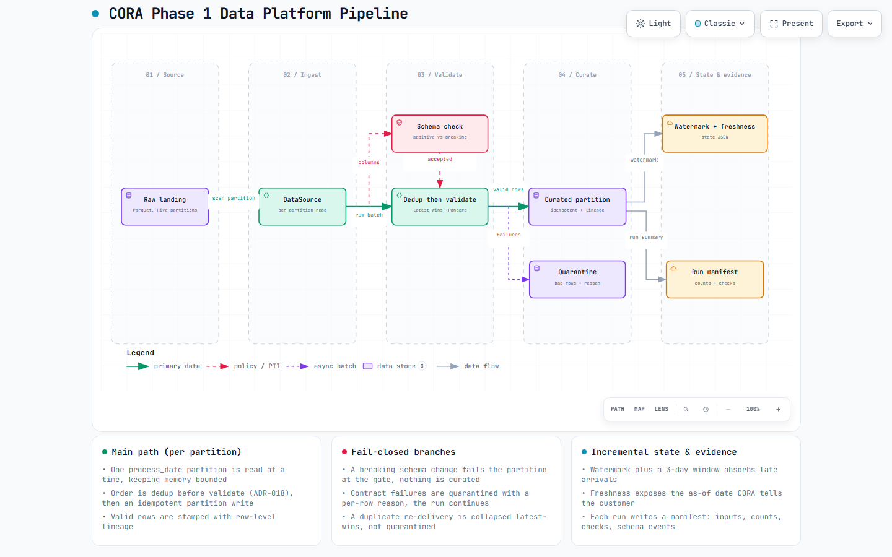

# CORA — Customer-Oriented Resolution Agent

> **AI-first banking customer service for LATAM Bank. Bilingual ES/PT. Controlled automation with human-in-the-loop.**
> The LLM proposes. **Deterministic code decides.** Identity, authorization, policy and confirmations never depend on model output.

Built for the **Factored AI & Data Hackathon 2026** on the synthetic **LATAM Bank** dataset (≈19M rows, 13 tables, Mexico / Colombia / Argentina).

> 🔗 **Live demo (temporary):** [`https://shabby-backer-language.ngrok-free.dev`](https://shabby-backer-language.ngrok-free.dev) — work-in-progress tunnel; may be offline between demo sessions.

<sub>**Language policy:** code and documentation are in **English**; the assistant's **customer-facing interactions** are in **Spanish (MX/CO/AR variants) and Portuguese**.</sub>

---

## The one-paragraph pitch

Call centers spend their most expensive minutes on the cheapest questions. In the LATAM Bank data, **Transactional + Product inquiries are ~57% of demand and already resolve at ~90% on first contact** — the highest-value, lowest-risk automation target in the whole book. CORA automates exactly that slice, grounded in real account data, and **escalates everything risky** (disputes, complaints, fraud) to a human with full context. It is engineered around one non-negotiable principle: **the model drafts language, but identity, authorization, policy and confirmation are deterministic code** — so a confident-but-wrong model can never leak an account or move money. Measured against a naive single-call LLM on a held-out suite, CORA leaked customer data on **0 of 15** adversarial cases (the naive baseline leaked on 1 of 16) and transferred escalations with **1.000 precision** while the baseline caught **none** of the 19 cases that needed a human.

---

## 1. A problem the data points to

The workflow was **chosen from evidence, not taste.** Full analysis: [`analysis/EDA_FINDINGS.md`](analysis/EDA_FINDINGS.md).

| Reason category | % of contacts | FCR | Median handle time | Decision |
|---|---|---|---|---|
| **Transactional** | 34.9% | **91.5%** | 203 s | **Automate** |
| **Product** | 22.2% | **89.6%** | 263 s | **Automate** |
| Technical | 15.0% | 69.8% | 361 s | Keep human |
| Complaint | 16.9% | **43.6%** | 431 s | **Escalate** |
| Commercial | 8.0% | 66.1% | 542 s | Keep human |
| Retention | 3.0% | 61.6% | 478 s | Keep human |

The read is clean: **Transactional + Product (~57% of volume, ~90% FCR, shortest calls) are safe to automate; Complaints (43.6% FCR, longest) are the data-justified human-handoff path.** Everything else stays with a human. _(offline measurement — our dataset.)_

### Business potential

**Potential savings: ≈ $0.47M USD/year** _(projection — range $0.3M–$0.65M, **not** a measured production result)._

Basis, stated openly per the contest's evidence rules:
- Volume: **390,919** in-scope (Transactional + Product) contacts measured over 3 years ÷ 3 ≈ **130,306/yr**; **90.8%** = current weighted FCR of these categories (offline measurement, our dataset).
- Unit economics: human assisted-contact **$3–6**, mature AI self-service **≈$0.50** (LATAM nearshore benchmark, [stealthagents 2026](https://stealthagents.com/) / [contactship.ai](https://contactship.ai/)). Marginal cost only — excludes build/integration, escalated-contact cost, handle-time gains and retention revenue.

> Per contest rules, this is a **projection**, not a production improvement claim. The measured results are in §4.

---

## 2. What CORA does — and deliberately does not

One coherent workflow, chosen for depth over breadth (SRC-15/16).

**Reads (grounded in permitted data):** balance · recent transactions · transaction status · card status & limit · FX conversion · product list.
**One reversible action:** card **freeze / unfreeze** — gated by explicit confirmation and **read-back verification**.
**Escalates to a human:** disputes · complaints · fraud · explicit human request — with a **full handoff package** (request + verified facts + actions taken + evidence + open questions).
**Out of scope by rule:** credit eligibility and **any movement of money** (POL-030 / REQ-33 / REQ-34).

The demo exercises all three required paths — **normal resolution**, **ambiguous / unsupported request**, and **a case requiring a human** — in both ES and PT. Script: [`documentation/reports/DEMO_SCRIPT.md`](documentation/reports/DEMO_SCRIPT.md).

---

## 3. Architecture — the LLM proposes, deterministic code decides

```
customer ─▶ FastAPI ─▶ Orchestrator (state machine)
                         │
   ┌─────────────────────┼───────────────────────────────────────┐
   │  LLM (Amazon Bedrock, proposes)   │  Deterministic code (decides)│
   │  • intent / entity extraction     │  • Identity: signed session   │
   │  • answer phrasing (draft)        │    token (JWT), fail-closed   │
   │                                   │  • Authorization: customer_id │
   │                                   │    from token, per-record     │
   │                                   │  • Policy engine (rules.yaml) │
   │                                   │  • Confirmation + read-back   │
   │                                   │  • Grounding checker          │
   └─────────────────────┴───────────────────────────────────────┘
                         │
         Tool layer (7 tools) ─▶ DataSource (DuckDB/Parquet → S3/Athena)
                         │
         Tracing (JSONL) · bounded retries · fail-closed fallback · human handoff console
```

Non-negotiable security invariants (see [`.kiro/steering/`](.kiro/steering/)):
- **Every factual value shown to a customer comes from a tool result in the same turn** — a deterministic grounding checker validates numbers, dates, currencies and statuses; factual answers render **template-only** so no LLM rephrase can swap a value (e.g. USD→COP).
- **`customer_id` is taken only from the verified session token**, never from model or user text. A national ID or customer number alone does **not** prove identity (SRC-61).
- **Report an action as done only after read-back verification** (REQ-09).
- **Fail closed:** on expiry, tampering, ambiguity or tool failure, disclose nothing, do nothing, offer a human.
- **PII is masked before any LLM call;** prompt-injection text is treated as data, never instructions.

Full design: [`.kiro/specs/cora/design.md`](.kiro/specs/cora/design.md) · decisions and alternatives: [`documentation/DECISIONS.md`](documentation/DECISIONS.md) · stack & local→AWS plan: [`ARCHITECTURE.md`](ARCHITECTURE.md).

### The learned component (ML rigor)

Intent classifier = **multilingual MiniLM embeddings + calibrated logistic regression** (Platt). Evaluated on held-out cases, **splits grouped by `scenario_id`** so an ES row and its PT translation never cross the split, **label-bearing fields never used as inputs**, near-duplicates (cosine > 0.95) removed — **no leakage**. Thresholds selected on validation and **frozen before the test split**.

- Real MiniLM run: **macro-F1 0.9354**, accuracy 0.942 (69-case test split).
- Download-free TF-IDF comparison on the same split: macro-F1 0.917.
- Baselines: majority macro-F1 0.062; keyword rules 0.744.

_(offline measurement — see [`documentation/reports/intent_model.md`](documentation/reports/intent_model.md) and [`data/nlu/model_card.json`](data/nlu/model_card.json). Encoder provenance caveat in §6.)_

---

## 4. Measured, not claimed — CORA vs. a naive LLM baseline

**400-case held-out suite** (ES 200 / PT 200), stratified MX/CO/AR; adversarial cases include **expired sessions, unauthorized access, prompt injection, tool failures and multilingual ambiguity**. Both configurations run on the **same workload**; every run stamps model id, prompt hash, code commit and data snapshot.

| Metric | Naive LLM (B1) | **CORA** | Why it matters |
|---|---|---|---|
| Disclosure leaks (unsafe) | **1 / 16** | **0 / 15** | No unauthorized account data exposed |
| Escalation precision | n/a (0/0) | **1.000** (13/13) | Never transfers the wrong case |
| Escalation recall | **0.000** (0/19) | **0.684** (13/19) | Catches most cases needing a human |
| Missed escalations | 19 | **6** | Fewer dangerous "handled it anyway" |
| Unnecessary escalations | 0 | **0** | No queue flooding |

**SAR (Safe Automated Resolution): CORA 0.40 vs B1 0.98 — by design.** The naive baseline answers almost everything (including unsafe cases); CORA **abstains and escalates when unsure**. We optimize for *safe* resolution, not raw containment.

**Honesty on safety:** 0 disclosure leaks across the adversarial suite is a **Wilson 95% CI upper bound of 0.20** — zero observed ≠ zero risk.

> ⚠️ **Reduced run disclosure (contest evidence rule).** The real B1-vs-CORA run used a **98-case stratified subset (49 es / 49 pt) at 1 repeat** due to a Bedrock quota, below the project's **≥3-repeats / full 400-case** rule. The headline numbers above are **offline measurements** on that reduced run; with 1 repeat there is no run-to-run variability. Full method, numerators/denominators, Wilson CIs, per-language/segment breakdown and error analysis: [`documentation/reports/EVALUATION.md`](documentation/reports/EVALUATION.md). The report is **regenerable** — rerun `.\tasks.ps1 eval` on a data host to replace every reduced value.

---

## 5. A credible route to operation

- **Tracing:** every turn emits per-node / per-tool spans to JSONL with a stable `trace_id`; explanations come from **traces, policy rule ids and tool results** — never model chain-of-thought (REQ-39 / SRC-52). PII masked at the serialization edge.
- **Bounded retries & safe fallback:** circuit breaker → template mode; classifier failure → keyword baseline; tool outage → honest ES/PT message + escalation. No telemetry write ever blocks a turn.
- **Service:** FastAPI (`/auth`, `/chat`, `/handoffs`) + a Streamlit customer UI and agent handoff console. `/chat` is fail-closed on a bad token (401); a smuggled `customer_id` is rejected (422); `/handoffs` requires an agent-console key.
- **Reproducible:** `uv` pinned lockfile, one-command evaluation, clean-clone audited.
- **AWS-ready:** Fargate/Lambda, DynamoDB, Cognito, Secrets Manager, CloudWatch/X-Ray, CDK — behind a `DataSource` / `LLMClient` seam so the local↔AWS swap is mechanical.
- **Load test:** 0 errors at concurrency 1/16/32 against the local stub path; ~110–125 turns/s. See [`documentation/reports/load_test.md`](documentation/reports/load_test.md).

Dossier: [`documentation/reports/PRODUCTION_READINESS.md`](documentation/reports/PRODUCTION_READINESS.md) · trade-offs across autonomy/accuracy/latency/cost/oversight: [`documentation/reports/TRADE_OFFS.md`](documentation/reports/TRADE_OFFS.md).

---

## 6. What's done, and what's honestly pending

**Delivered (phases 0–7):** data platform (contracts, quality checks, dedup, incremental pipeline, lineage, labeled correctness fixture) · identity + tool/authorization layer + policy engine · NLU (gold set, PT set, leakage-safe splits, calibrated classifier, frozen thresholds) · LangGraph-style agent orchestration (grounding, confirmation, handoff, dispute intake, credit/money guards) · reliability + tracing + FastAPI + UIs · full evaluation harness (scenario builder, B0/B1 baselines, deterministic judges, metrics with Wilson CIs, fairness, LLM-judge for subjective quality) · production-readiness dossier + submission audit. Suite: **538 passed / 1 skipped**, ruff clean.

**Honest gaps** — consolidated and labeled in [`documentation/reports/LIMITATIONS.md`](documentation/reports/LIMITATIONS.md):
- **Reduced eval run** (98 cases, 1 repeat) vs the ≥3-repeat / 400-case rule — Bedrock quota. _(offline measurement)_
- **Portuguese is team-generated / translated** (dataset is ES-only); carries a translationese caveat and is not validated against real PT traffic. _(provenance-labeled)_
- **Transcripts are synthetic/templated;** the gold set is team-written. _(simulation)_
- **Subjective quality uses robust-LLM silver labels,** not ≥50 human labels — a documented gap. _(simulation)_
- **Cost is unmeasured** (no token capture wired); when priced it is an output-tokens-only estimate. _(projection)_
- **Orchestration is a stdlib dispatcher, not LangGraph** (not installable here); the "each transition is code, not prompt" invariant is identical and the swap is mechanical. _(ADR-004)_
- **freeze/unfreeze is modeled via a sandbox overlay** (no native field); the Confirm→Execute→Verify protocol and read-back are real. _(simulation)_
- **Phase 8 (AWS migration)** is post-submission.

---

## 7. Getting started

Python 3.12 and [uv](https://docs.astral.sh/uv/). Dependencies pinned in `uv.lock`.

| Make (Linux/macOS) | PowerShell (Windows) | What |
|---|---|---|
| `make setup` | `.\tasks.ps1 setup` | `uv sync --locked --all-groups` |
| `make lint` | `.\tasks.ps1 lint` | ruff check + format check |
| `make test` | `.\tasks.ps1 test` | pytest (self-contained; NLU/LLM stubs) |
| `make eval` | `.\tasks.ps1 eval` | full evaluation chain (needs landed data + Bedrock) |
| `make demo` | `.\tasks.ps1 demo` | run the customer UI / demo paths |

Configuration: copy `.env.example` to `.env` (gitignored); loaded by [`src/cora/settings.py`](src/cora/settings.py). **Only profile names, regions and model ids** go there. AWS credentials come from SSO / the read-only `cora-datathon` profile — **never long-lived keys**. Model ids come from `.env` (`CORA_BEDROCK_*`), never hard-coded. Setup guide: [`documentation/AWS_SETUP.md`](documentation/AWS_SETUP.md).

Steps 1–3 (install + lint + test) reproduce from any machine with `uv`, no data or credentials needed. The `eval` chain **fails closed with a clear message** when inputs are absent — it never fabricates numbers.

---

## 8. Documentation map

**Spec-driven plan (Kiro specs, EARS criteria, full traceability):**
- [`.kiro/specs/cora/requirements.md`](.kiro/specs/cora/requirements.md) — 52 testable requirements.
- [`.kiro/specs/cora/design.md`](.kiro/specs/cora/design.md) — architecture, state machine, policy engine, contracts.
- [`.kiro/specs/cora/tasks.md`](.kiro/specs/cora/tasks.md) — phased implementation tasks.
- [`documentation/SOURCE_REQUIREMENTS.md`](documentation/SOURCE_REQUIREMENTS.md) — all 84 obligations from the brief and data docs.
- [`documentation/TRACEABILITY.md`](documentation/TRACEABILITY.md) — source → requirement → task → evidence (**84/84 mapped**).
- [`documentation/DECISIONS.md`](documentation/DECISIONS.md) — ADRs with alternatives and rationale.
- [`documentation/DEVELOPMENT_PLAN.md`](documentation/DEVELOPMENT_PLAN.md) — process, schedule, quality gates, risks.

**Context & evidence:**
- [`CORA_CONTEXT.md`](CORA_CONTEXT.md) — self-contained challenge + dataset context (no PDFs needed).
- [`analysis/EDA_FINDINGS.md`](analysis/EDA_FINDINGS.md) — exploratory analysis, charts, workflow selection.
- [`documentation/reports/EVALUATION.md`](documentation/reports/EVALUATION.md) · [`TRADE_OFFS.md`](documentation/reports/TRADE_OFFS.md) · [`LIMITATIONS.md`](documentation/reports/LIMITATIONS.md) · [`PRODUCTION_READINESS.md`](documentation/reports/PRODUCTION_READINESS.md) · [`DEMO_SCRIPT.md`](documentation/reports/DEMO_SCRIPT.md) · [`SUBMISSION_AUDIT.md`](documentation/reports/SUBMISSION_AUDIT.md).

### Diagrams

Architecture and flow diagrams live under [`analysis/figures/`](analysis/figures/) as interactive, self-contained HTML (theme toggle, zoom/pan, relationship tracing), each with a committed PNG and versioned `*.dataflow.json` source.

**Phase 1 — data platform pipeline:** how a daily `process_date` partition becomes trustworthy curated data — read one partition at a time, dedup latest-wins, validate against the contract, quarantine bad rows, write an idempotent curated partition with row-level lineage, plus watermark/freshness state and a per-run manifest; fail-closed on a breaking schema change.



Interactive version: [`analysis/figures/pipeline_phase1.html`](analysis/figures/pipeline_phase1.html).

---

## 9. Security & data use

**Synthetic data only.** No real credentials in the repo: datathon S3 keys load from an AWS profile / env var; `.gitignore` excludes `.env` and the original PDFs under `Docs/` (which contain plaintext credentials). CI gates every push with **gitleaks** (full history) and a **no-PDF** check. No private records, credentials or restricted data appear in this submission or any external model request (SRC-59). Audit: [`documentation/reports/SUBMISSION_AUDIT.md`](documentation/reports/SUBMISSION_AUDIT.md).

---

<sub>Factored AI & Data Hackathon 2026 · Harold Uribe-Romero · October 2026 · [LinkedIn](https://www.linkedin.com/in/haroldgiovannyuribe/)</sub>
