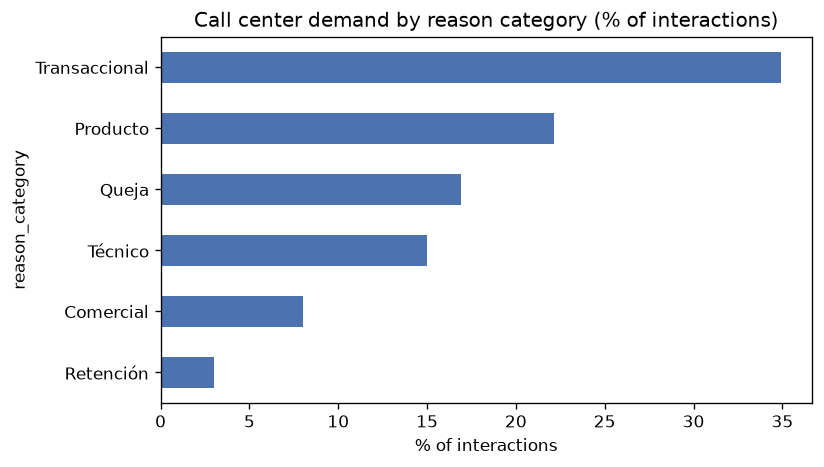
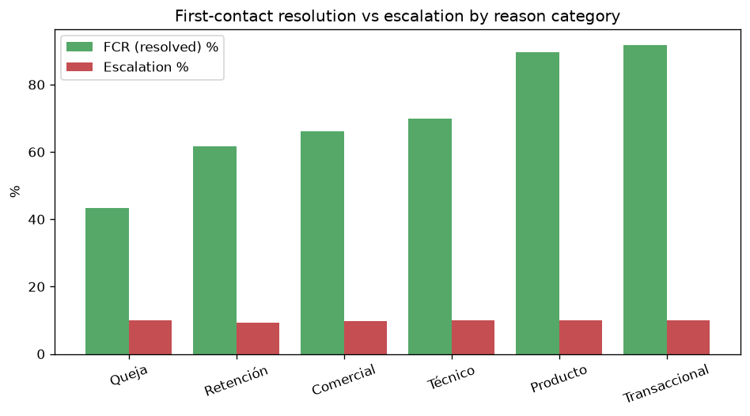
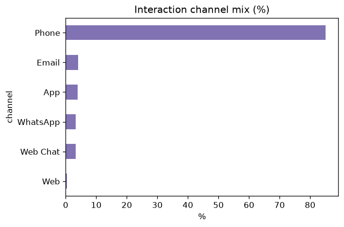
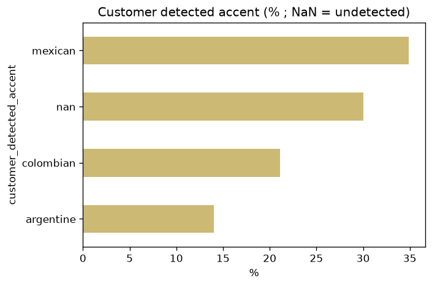

# CORA - Exploratory Data Analysis & Workflow Selection

**Date:** 2026-10-01
**Author:** Harold Uribe (with Kiro)
**Scope:** Factored AI & Data Hackathon 2026 - evidence for *"a problem supported by data"* (evaluation axis 1).

Reproduce with:

```bash
python analysis/eda_sample.py --outdir analysis/figures
```

Raw metrics: [`analysis/figures/metrics.json`](figures/metrics.json).

---

## 1. Sample

A local, multi-day sample was pulled from the organizer S3 bucket (`us-east-2`, read-only) to drive workflow selection without scanning all 19M rows.

| Table | Rows | Days | Date range |
|---|---|---|---|
| `call_center_interactions` | 105,485 | 168 | 2026-01-01 to 2026-06-18 |
| `complaints` | 10,332 | 168 | 2026 (Jan-Jun) |

> This is the full Jan-Jun 2026 window for both tables (they are small fact tables). It is a recent, representative demand slice, not a cherry-picked day.

## 2. Where the demand is

Call-center demand splits into six generic reason categories. Transactional + Product dominate (~57% combined).



| reason_category | % of interactions |
|---|---|
| Transaccional | 34.9% |
| Producto | 22.2% |
| Queja (complaint) | 16.9% |
| Técnico | 15.0% |
| Comercial | 8.0% |
| Retención | 3.0% |

## 3. What is safely automatable vs. what must escalate

First-contact resolution (FCR = `was_resolved`) varies sharply by category, while the *escalation* flag is flat (~10% everywhere - synthetic noise). FCR is the real signal.



| reason_category | FCR % | Median handle time (s) |
|---|---|---|
| Transaccional | **91.8%** | 203 |
| Producto | **89.7%** | 263 |
| Técnico | 69.8% | 361 |
| Comercial | 66.1% | 542 |
| Retención | 61.6% | 478 |
| Queja | **43.3%** | 431 |

**Reading:** Transactional and Product inquiries already resolve on first contact ~90% of the time and are the shortest calls -> highest-value, lowest-risk automation targets. Complaints resolve only 43% first-contact and take longer -> a natural *escalate-to-human* path, not an automation target.

## 4. Channel & language



Phone dominates at 85%; digital text channels (App, Web Chat, WhatsApp, Email) together ~14.5%. A text-first assistant maps cleanly onto the digital channels and onto transcribed phone calls (`call_transcripts`).



Customer accent is Mexican 34.9% / Colombian 21.1% / Argentine 14.0% / undetected 30.0%. **All text in the dataset is Spanish - there is no Portuguese data.** The hackathon still requires ES + PT interactions, so **Portuguese must be covered with our own labeled evaluation fixtures**, reported as a known data limitation.

## 5. Data-quality findings that shape the design

- **`contact_reason` == `reason_category`** in this sample (fully redundant; `contact_reason` carries no finer signal).
- **`complaints.origin_interaction_id` is 0% populated** -> there is *no* usable join between complaints and the originating call-center interaction in this data. This **weakens a "transaction-dispute intake" workflow** that would rely on that link.
- **`complaints.category` is near-uniform** (~2,000 each across Fees / Transactions / Service / Technical / Branch) -> little signal about "where it hurts"; synthetic flat distribution.
- `complaints.status` is mostly open/in-process (Open 29% + In Process 40%); `sla_breached` 20.5%.
- These are consistent with the documented quality challenges (~2% dup, ~5% null, late arrivals, schema evolution) and must be handled by data contracts + quality checks (axis 4).

## 6. Workflow decision

**Chosen workflow: Account & transaction information + payment/card inquiries (Transactional + Product).**

Rationale, grounded in the data above:
1. **Largest demand** - ~57% of all interactions.
2. **Highest safe-automation ceiling** - 90-92% FCR today; these are factual, policy-bounded lookups that an AI-first assistant can ground in `transactions`, `products`, `customers`, `daily_exchange_rates`.
3. **Shortest handle time** - best latency/cost profile for the efficiency metrics (axis 5).
4. **Clean escalation contrast** - Complaints (43% FCR) give us a credible, data-justified *human handoff* path to demonstrate (required by the brief), without depending on the broken `origin_interaction_id` link.
5. **Guardrail-friendly** - these flows read permitted account/transaction data; they do **not** require inventing eligibility rules or moving money (which the brief forbids).

**Explicitly rejected:** *transaction-dispute intake* as the primary flow - the complaints<->interaction join is empty (0%) and complaint categories are flat, so the data cannot support a rigorous dispute pipeline. (A dispute *intake-and-escalate* path can still appear as the human-handoff demo case.)

**Demo cases to build (required by the brief):**
- *Normal resolution:* "What's my checking balance / last 5 transactions / this card's limit?" grounded in account data, with authn + per-customer authorization.
- *Ambiguous / unsupported:* vague or out-of-scope request -> clarify, then abstain/redirect.
- *Human intervention:* a complaint or disputed charge -> escalate with full handoff context (request, verified facts, actions taken, open questions).
- *Multilingual:* the same flows in ES and PT (PT via labeled fixtures).

## 7. Next steps

1. Define data contracts (Pandera) + quality checks for the tables this workflow reads.
2. Stand up the tool/policy layer: identity/session, per-customer authorization, read-only account/transaction tools with documented contracts.
3. Build the LangGraph decision flow (answer / confirm / abstain / escalate).
4. Build the evaluation harness (held-out cases incl. adversarial: prompt injection, unauthorized access, expired session, tool failure, ES/PT ambiguity) and a baseline to compare against.

---

## 8. All 13 tables profiled vs the data dictionary (2026-10-01)

Reproduce: `python analysis/profile_tables.py --sample <sample_dir> --out documentation/reports`.
Full output: [`documentation/reports/data_profile.md`](../documentation/reports/data_profile.md) / `.json`.

**Bucket coverage (full, not sampled):** every fact table has 1,097 daily partitions from 2023-06-17 to 2026-06-17, except `campaign_sends` (1,083, starts 2023-07-01). Raw size ≈ 5.35 GB of CSV, 70% of it `digital_events` (3.76 GB).

**Profiled:** the six dimension/reference tables in full; `transactions`, `digital_events`, `campaign_sends` for 2026-06 (17 days); `call_transcripts`, `satisfaction_surveys`, `call_center_interactions`, `complaints` for 2026-H1.

| # | Finding | Evidence | Impact on CORA |
|---|---|---|---|
| F1 | **Schemas match the dictionary exactly** in all 13 tables (no missing/extra columns). | data_profile.md | Contracts can be generated from the dictionary. |
| F2 | **Categorical values are in Spanish, not the English listed in the dictionary**: `Cuenta Ahorro`, `Tarjeta Crédito`, `México`, `Pasaporte`, `Transaccional`, `Queja`... | enums in data_profile | Contracts must encode the *observed* vocabulary + a mapping to canonical English codes. |
| F3 | **No MXN anywhere.** All 200,398 products of Mexican customers are in `USD`; Argentina = ARS (+ some USD), Colombia = COP (+ some USD). Transactions likewise have no MXN. | country × currency crosstab | Likely data defect (MXN labeled as USD). CORA must state the currency exactly as recorded and must not silently relabel; flagged as a known data limitation and a policy decision (ADR-016). |
| F4 | **Duplicates observed: 0%** (PK and full-row, within and across the sampled days) vs "~2%" documented. | data_profile | Keep dedup (defensive, contract-driven), report observed rate honestly; the fixture (REQ-26) injects duplicates to prove the logic. |
| F5 | **Orphan FKs observed: 0%** for customer/product/agent in all sampled facts vs "small %" documented. | data_profile | Same: check stays, observed rate reported. |
| F6 | **Null rates vary widely, many are structural**, not the uniform "~5%": `credit_limit`/`days_past_due` ~69% (only credit products), `landline_phone` 50%, `customer_detected_accent` ~30%, `complaints.origin_interaction_id` **100%**. | top_null_columns | Contracts declare nullability per column, conditional on product type where structural. |
| F7 | **Call transcripts are fully templated:** 26,552 transcripts contain only **42 distinct `customer_text`** strings; `detected_intents` = `consulta_general` in 95%; `detected_language` = `es` in 100%. | transcripts check | Transcripts are **not valid training/test labels** for the intent classifier (would leak and look perfect). Gold set must be team-written (ADR-008 updated). Confirms no Portuguese. |
| F8 | `daily_exchange_rates` has **13,164 rows** (1,097 days × 12 currency pairs), not 3,000 as documented. | row count | FX conversion has full daily coverage for all pairs. |
| F9 | Fraud is rare: `is_fraud` = 0.10% of June transactions (69 / 70,691). | enums | Fraud escalation (E3) needs synthetic scenarios to be evaluated with a meaningful sample. |
| F10 | `satisfaction_surveys.nps_category` has **no Promoters** (only Detractor / Passive among non-null). | enums | Survey data is not a reliable outcome label; used only descriptively. |
| F11 | Transactions are mostly card/cash (POS 35%, ATM 30%); merchant fields ~77% null (non-purchase types). | enums, nulls | Merchant-based search must tolerate missing merchants. |

These findings were not visible from the dictionary alone; each one changes a contract, a decision or a stated limitation.
