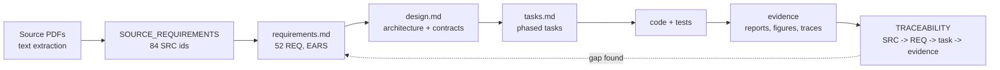

# CORA - Development Plan

How we build CORA in ten days without missing anything the brief asks for.

## 1. Framework: spec-driven development

| Artifact | Location | Purpose |
|---|---|---|
| Source inventory | `documentation/SOURCE_REQUIREMENTS.md` | Every obligation in the PDFs, ID'd. |
| Requirements | `.kiro/specs/cora/requirements.md` | What, as testable EARS criteria. |
| Design | `.kiro/specs/cora/design.md` | How: architecture, contracts, diagrams. |
| Tasks | `.kiro/specs/cora/tasks.md` | Ordered work with requirement links. |
| Decisions | `documentation/DECISIONS.md` | Why: ADRs with alternatives. |
| Traceability | `documentation/TRACEABILITY.md` | Proof of 100% coverage. |
| Steering | `.kiro/steering/*.md` | Standing rules for every Kiro session on this repo. |

**Why spec-driven:** the scoring is about demonstrated behavior and rigor across 6 axes; a spec makes
each axis an explicit, testable requirement, and the matrix makes omissions impossible to hide.
The `.kiro/` layout lets Kiro execute tasks against the spec with the same rules every session.

## 2. Workflow per task

1. Pick the next unchecked task in `tasks.md`; create `feat/<area>-<short>` from `main`.
2. Write tests from the EARS criteria first (they are the acceptance tests).
3. Implement; run `ruff` + targeted `pytest`.
4. Produce the task's evidence (report/figure/doc).
5. Update `TRACEABILITY.md` status and tick the task.
6. PR to `main` with summary, what was tested, and linked REQ ids; owner approves and merges.

## 3. Schedule (10 working days)

| Day | Phase | Exit criterion |
|---|---|---|
| 1 | 0 Foundations · 1 Data (start) | skeleton, CI, sample fetch, contracts drafted |
| 2 | 1 Data | quality checks, dedup, incremental pipeline, lineage |
| 3 | 1 Data (fixture, EDA+) · 2 Identity | fixture tests green; IdP + sessions |
| 4 | 2 Tools & policy · 3 Labels | tools with authZ, policy engine tested; gold set in progress |
| 5 | 3 NLU · 4 Agent (start) | baselines + classifier trained; graph skeleton |
| 6 | 3 Thresholds · 4 Agent | thresholds frozen; grounding, confirmation, handoff |
| 7 | 5 Reliability & service · 6 Eval (start) | tracing, retries, API, UI; scenario suite built |
| 8 | 6 Evaluation | B1 vs CORA ×3 runs, judges, metrics |
| 9 | 6 Report · 7 Readiness | EVALUATION.md, fairness, load test, dossier |
| 10 | 7 Submission | demo video, limitations, clean-clone audit, final traceability |

Buffer: Day 10 afternoon. If behind schedule, cut in this order (never cut safety or evaluation):
Langfuse UI -> LLM-simulated users -> TF-IDF comparison -> AWS phase.

## 4. Quality gates (Definition of Done for the submission)

- [ ] Traceability: 84/84 SRC `Done` with evidence links.
- [ ] All EARS criteria have a passing test or an evaluation metric.
- [ ] Evaluation report includes failures, CIs, versions, 3-run variability, per-language/segment cuts.
- [ ] Zero secrets in history (gitleaks) and no PDFs committed.
- [ ] Clean clone reproduces data -> eval -> demo with documented commands.
- [ ] Demo shows the five required paths in es and pt.

## 5. How the plan maps to the six scored axes

| Axis | Where it is won |
|---|---|
| 1 Problem supported by data | REQ-01..03 · `analysis/` · outcomes & trade-off tables |
| 2 Functioning AI system | REQ-06..09, 18 · LangGraph + grounding + verified actions |
| 3 Controlled automation | REQ-10..17, 33, 34 · policy engine, IdP, handoff |
| 4 Data & ML practice | REQ-20..32 · contracts, lineage, fixture, classifier vs baselines |
| 5 Quality & failure handling | REQ-35, 40..47 · adversarial suite, unsafe-outcome stats, fairness |
| 6 Route to operation | REQ-39, 40, 48..52 · tracing, retries, dossier, AWS path |

## 6. Risk register

| Risk | Impact | Mitigation |
|---|---|---|
| Synthetic transcripts are template-like -> classifier looks perfect | Inflated metrics | Time+customer split, near-dup removal, team-written held-out utterances, report it |
| No Portuguese data | Weak PT claim | ADR-011 fixtures, separate PT metrics, stated limitation |
| LLM cost/latency | Efficiency axis | Small model, templates for fixed answers, cache, measure p95 |
| Laptop RAM (~4 GB free) | Slow dev | DuckDB, sampled data, CPU-small embeddings, no heavy local LLM |
| Credentials in source PDF | Leak | `Docs/` ignored, gitleaks in CI, profile-based access |
| Scope creep | Shallow solution | ADR-001; any new capability needs a REQ + matrix row first |

## 7. Open decisions (owner)

- ADR-005 LLM provider (Bedrock proposed).
- Submission deadline date (schedule assumes 10 working days from 2026-10-01).
