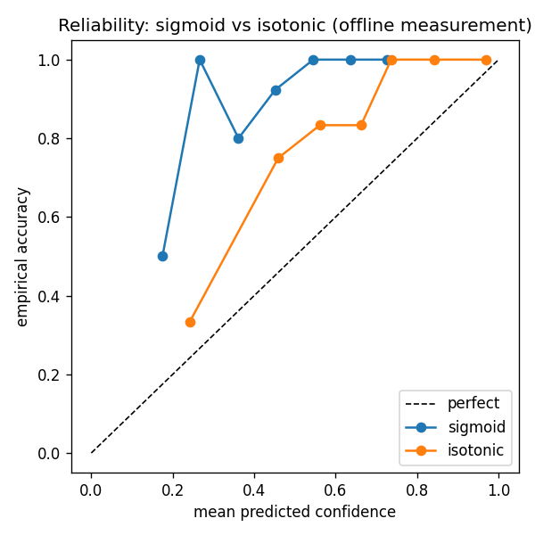
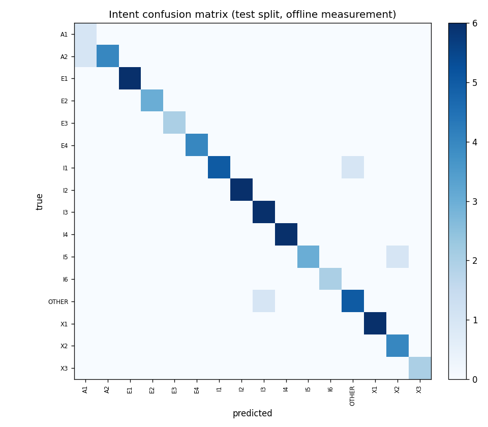
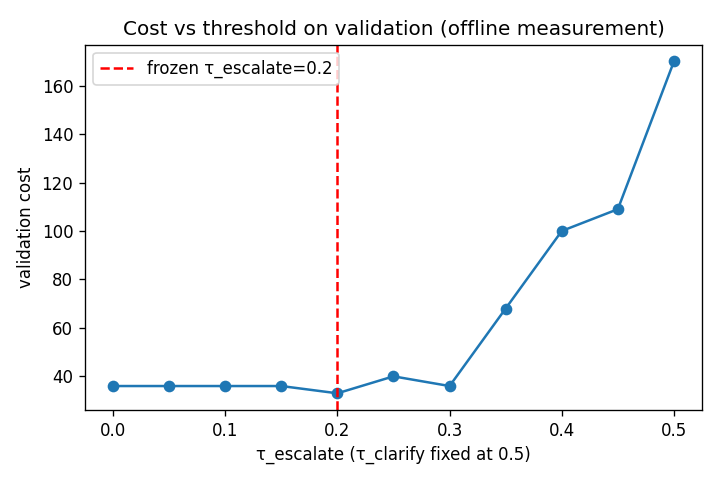

# Intent model report (task 3.6)

_All numbers are **offline measurement** (REQ-47), produced by `data/nlu/train_intent_model.py`
from the committed gold set and the leakage-safe `data/nlu/splits.json`. This file is generated,
not hand-edited, so it always matches `data/nlu/model_card.json` and `data/nlu/thresholds.json`._

## 1. Representation justification

The locked representation is frozen **multilingual MiniLM** embeddings
(`paraphrase-multilingual-MiniLM-L12-v2`, 384-d, CPU) + a calibrated linear head. One multilingual
space covers es and pt, which is what makes Portuguese work with **no PT training data** beyond the
team-written set. On a small gold set (~20 utterances/class in train) a high-capacity model would
memorise; a linear head over a fixed embedding generalises and stays calibratable. The **TF-IDF
char-ngram** variant is the deliberate "no cross-lingual transfer" comparison (NIT-3): `char_wb`
shares no space across es/pt, so its es-vs-pt behaviour read against MiniLM's is the contrast the
comparison exists to surface.

> **Encoder provenance (honesty, REQ-47).** STUB (sandbox could not download MiniLM weights; the real-encoder path in train_intent_model.py is unchanged and re-runs on a host with HF access). TF-IDF numbers are download-free and real either way.
> Encoder in this run: `StubEncoder (hash, 64-d) - MiniLM weights not downloadable in this sandbox`. The TF-IDF numbers are download-free and real
> regardless; the MiniLM-head numbers below carry this provenance caveat.

## 2. Metrics justification

Macro-F1 (not accuracy) is the headline metric because the classes are imbalanced and the rare
**escalation** classes matter most - a missed escalation is unsafe. We therefore report **per-class
recall with E1-E4 called out**, ECE for calibration quality, the full confusion matrix, and an
es-vs-pt breakdown with sample sizes.

## 3. Baseline vs classifier

| model | macro-F1 | accuracy | ECE | es macro-F1 | pt macro-F1 |
| --- | --- | --- | --- | --- | --- |
| B-maj (majority) | - | 0.062 | - | - | - |
| B-kw (keyword es/pt) | - | 0.744 | - | 0.812 | 0.675 |
| MiniLM + LogReg (calibrated) | 0.4454 | 0.4605 | 0.1356 | 0.4077 | 0.4586 |
| TF-IDF char-ngram (no x-lingual) | 0.9321 | 0.9211 | 0.4378 | 0.889 | 0.9786 |

Train carries **15 of 16 classes**: X3 is emptied from train by the 3.3 cross-split dedup
(`splits.json` `missing_after_dedup`), so it is unlearnable here and is **not** inflated away.

### Escalation recall (the safety-critical classes)

| class | MiniLM recall | TF-IDF recall |
| --- | --- | --- |
| E1 | 0.3333 | 0.6667 |
| E2 | 0.8 | 1.0 |
| E3 | 0.75 | 1.0 |
| E4 | 0.5 | 1.0 |

> **TF-IDF ECE is high (0.4378) relative to its accuracy (0.9211)** and worse
> than the MiniLM head (0.1356). This is the known over-confidence of a char-ngram model that
> separates the training classes almost perfectly but whose probabilities are poorly spread - exactly
> why calibration quality (ECE), not accuracy alone, is reported. The committed numbers are
> single test-split point estimates; the reliability figure uses CV folds for the calibration curve.

## 4. Calibration (D2: sigmoid, not isotonic)

Calibration method is **sigmoid/Platt**, the recorded decision D2: at ~20 samples/class an isotonic
(non-parametric) map overfits, while sigmoid fits two parameters per class. The reliability figure
shows both curves as evidence; sigmoid is the frozen default.


_Reliability curve, offline measurement._


_Intent confusion matrix on the test split, offline measurement._

## 5. Threshold selection (cost-matrix, on validation, frozen before test)

The policy engine evaluates `rules.yaml` top-down, so the decision surface is **three confidence
bands**, with escalate as the lowest-confidence outcome:

```
conf < tau_escalate                 -> escalate   (POL-060)
tau_escalate <= conf < tau_clarify  -> clarify     (POL-070)
conf >= tau_clarify                 -> answer      (POL-090)
```

`src/cora/nlu/thresholds.py` sweeps candidate `(tau_escalate, tau_clarify)` pairs on a 0.00-1.00
grid (step 0.05), assigns each **validation** prediction to its band, and minimises expected cost
under the named cost matrix. The ordering is the brief's priority: **unsafe automation (100) >> unnecessary escalation (10) >> clarification (1) >> correct answer (0)**. The invariant
`tau_escalate <= tau_clarify` is a **hard grid constraint and a final assert**, so the frozen pair
is always representable by POL-060/POL-070 - the engine's rule order can never be handed a pair it
cannot express.

**Frozen pair (selected on validation, n=45):**
`tau_escalate = 0.2`, `tau_clarify = 0.5`
(validation cost 33.0). Written to `data/nlu/thresholds.json`
**before** the test split was evaluated (REQ-47 freeze discipline). These are the real values for
the `rules.yaml` POL-060 / POL-070 placeholders; `tau_fraud` (POL-040) is a fraud-score cutoff on a
0-100 scale, **not** an intent confidence, and is **not** re-derived here.


_Validation cost vs tau_escalate (tau_clarify fixed at the frozen value), offline measurement._

## 6. es vs pt breakdown

| language | n (test) | MiniLM macro-F1 | TF-IDF macro-F1 |
| --- | --- | --- | --- |
| es | 39 | 0.4077 | 0.889 |
| pt | 37 | 0.4586 | 0.9786 |

PT is synthetic (translated + a 20% native-style rewrite, provenance-tagged); per the
`LABELING_GUIDE.md` limitation note, PT metrics are reported with sample sizes and read as
indicative, not production-grade.

## 7. Error analysis (real misclassified test examples, REQ-47)

Concrete MiniLM-head misclassifications on the test split (top 8):

| utterance | lang | true | predicted | conf |
| --- | --- | --- | --- | --- |
| `Oye, ¿me checas mi saldo por favor?` | es | I1 | X1 | 0.18 |
| `Hágame el favor y me dice mi saldo` | es | I1 | I2 | 0.319 |
| `¿Cuánto gasté el fin de semana pasado?` | es | I2 | I1 | 0.452 |
| `Quiero ver mis compras recientes` | es | I2 | E1 | 0.262 |
| `¿Qué pasó con el pago que hice ayer, no se ha reflejado?` | es | I3 | E2 | 0.222 |
| `¿Qué pasó con el pago de ayer que no se ve?` | es | I3 | I6 | 0.329 |
| `¿Cuántos días llevo de atraso en el pago?` | es | I4 | I1 | 0.326 |
| `¿Qué estado tiene mi tarjeta en este momento?` | es | I4 | I2 | 0.335 |

The dominant failure mode is **low-confidence confusion between neighbouring servicing intents**
(the embedding head on the stub space keeps these near the decision boundary), which is exactly
what the threshold bands catch: at the frozen `tau_escalate`/`tau_clarify` these low-confidence rows
route to clarify/escalate rather than being answered, so a classifier miss degrades to a safe
clarification or human handoff instead of an unsafe automated answer.
